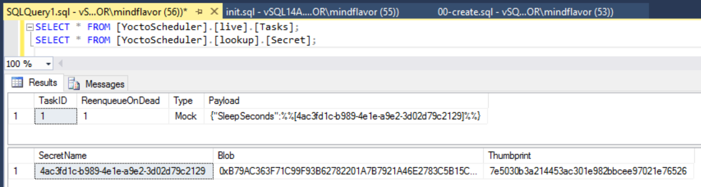

## Intro
YoctoScheduler is a muli-thread, multi-process scheduling system. Each server in  a cluster should be indpendent from the others while maintaining some architectural constraints.

## Legend

Entity Name | Description
------------|---------|
Task | Atomic execution block. A task will never migrate between servers. |
Server | Schedulator and executor process. A server manipulates the companion database.
Task status | A ```task``` can either be alive or dead. If not alive there is also a description of why is not running.
Schedule | A predefined fire time for a ```Task```. It supports the ```NCronTab``` syntax to be flexible (up to the single minute).
Workflow | A collection of task to be orchestrated as a single entity.

## Requisites

### Mandatory
* Each server must be independent and must rely on the companion database only.
* A schedule must fire at most *once*.
* If a schedule fires when there are no servers running the schedule is *lost*.
* Each task should be atomic and transactional. A task might fail at any moment and can be restarted on the same server (or another one).
  > this constraint can be relaxed at first
* Each task must update its status at least each ***to_define_task_update_frequency*** seconds. An update will update the ```LastUpdate``` field in the ```[live].[ExecutionStatus]``` table.
* A task not updating its status for ***to_define_task_timeout*** seconds is considered dead. A dead task will be removed from the ```[live].[ExecutionStatus]``` table and placed in the ```[dead].[ExecutionStatus]``` table (along with a specific status).
* A dead task will be restarted if so specified (the ***restart logic is to be defined***).

### Nice to have
* Each task should read its configuration from the centralized server (to encourage task independence).
* A task can spawn another task(s) as result of its elaboration.
* You can create workflows that chain task based on:
  * Status (successful, failed, in exception)
  * Constant match (ie ```if return number = 1 then ... else if ...```)
  * Resources available
* The server can schedule concurrent tasks inspecting the available resources (to better scale in parallel).

## Requisites

* SQL Server 2012+ or SQL Azure database (***untested***).
* A database and a ```dbo_owner``` user with relative login.
* C# 4.5.2. Visual Studio is suggested but not required.

## Installation
As now the ```Test console``` project is just a demo server with a tiny command line parser useful to test the commands. To use it:

1. Execute the [oop-tsql\00-create.sql](oop-tsql\00-create.sql) script. This will create the required database.
2. Compile, configure (see next section) and run.

## Configuration

See the specific section: [configuration](docs/configuration.md).

## Interaction

Check out the [REST API reference](docs/rest/rest.md), the command line tool is just for debugging purposes.

## Testing


The test client accepts simple commands. The output will be garbled as the log goes there too. To test a schedule you have to create a task first and then schedule it.

### Task
You can add a new mock task with

```
new_mock_task true|false <sleep_seconds> <certificate_thumbprint>
```
The first parameter specifies if the task should be re-enqueued in case declared dead.
The second the number of seconds to sleep.
The third is the encryption certificate thumbprint.

This call will basically do these steps:

1. Create a new secret (whose name is autogenerated) encrypting the ```<sleep_seconds>``` parameter.
2. Create a new mock task configured with the previous secret.

If successful the output will tell you the task ID. You can check on the database the results:



Let's follow up and schedule this task. This way we can make sure that our chosen sleep time is decoded correctly (and automatically).

### Schedule

To add a schedule just call the ```new_schedule``` command specifying the task ID, if it should be enabled and the cron statement. For example this command will schedule the task 2 to fire every minute. The schedule will be enabled.

```
new_schedule 2 true * * * * *
```
For details on the cron syntax refer here: [https://github.com/atifaziz/NCrontab](https://github.com/atifaziz/NCrontab).

### Secret

You can create a secret using the ```new_secret``` command. You have to specify the certificate thumbprint (as found in ```My``` certificate store) and the text to encrypt.

```
new_secret DE7017CAE4B519373569B051394AB7052FAE0264 This should be encrypted
```

If you need a self signed certificate you can use this PS (from [http://www.virtues.it/2015/09/howto-create-self-signed-certificates-posh40/](http://www.virtues.it/2015/09/howto-create-self-signed-certificates-posh40/)). Official TechNet docs are [here](https://technet.microsoft.com/library/hh848633).

```ps1
New-SelfSignedCertificate -DnsName "YoctoScheduler" -CertStoreLocation Cert:\CurrentUser\My
```
Look the thumbprint in the certificate store. The thumbprint is case *insensitive*.


You can also test the retrieval of a secret using the ```get_secret``` command. It takes the secret ID and should display the plain text:

```
get_secret 3
```

There is a bug in PS generated certificates. See the [```System.Security.Cryptography.CryptographicException: Invalid provider type specified```](docs/System.Security.Cryptography.CryptographicException.md) known issues section how to resolve this.

## Known issues

* [```System.Security.Cryptography.CryptographicException: Invalid provider type specified```](docs/System.Security.Cryptography.CryptographicException.md).

* [```Access denied``` during Owin initialization](docs\owin-access-denied.md).

## Debug

TODO

## License
Please see the [LICENSE](LICENSE) file for details.
