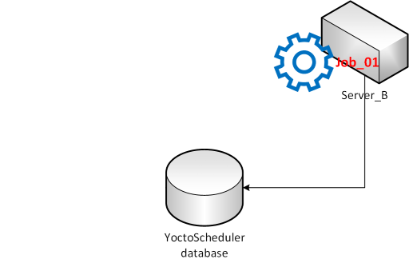
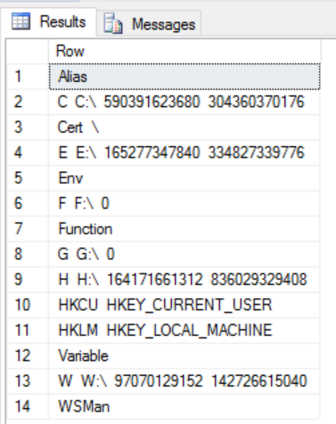
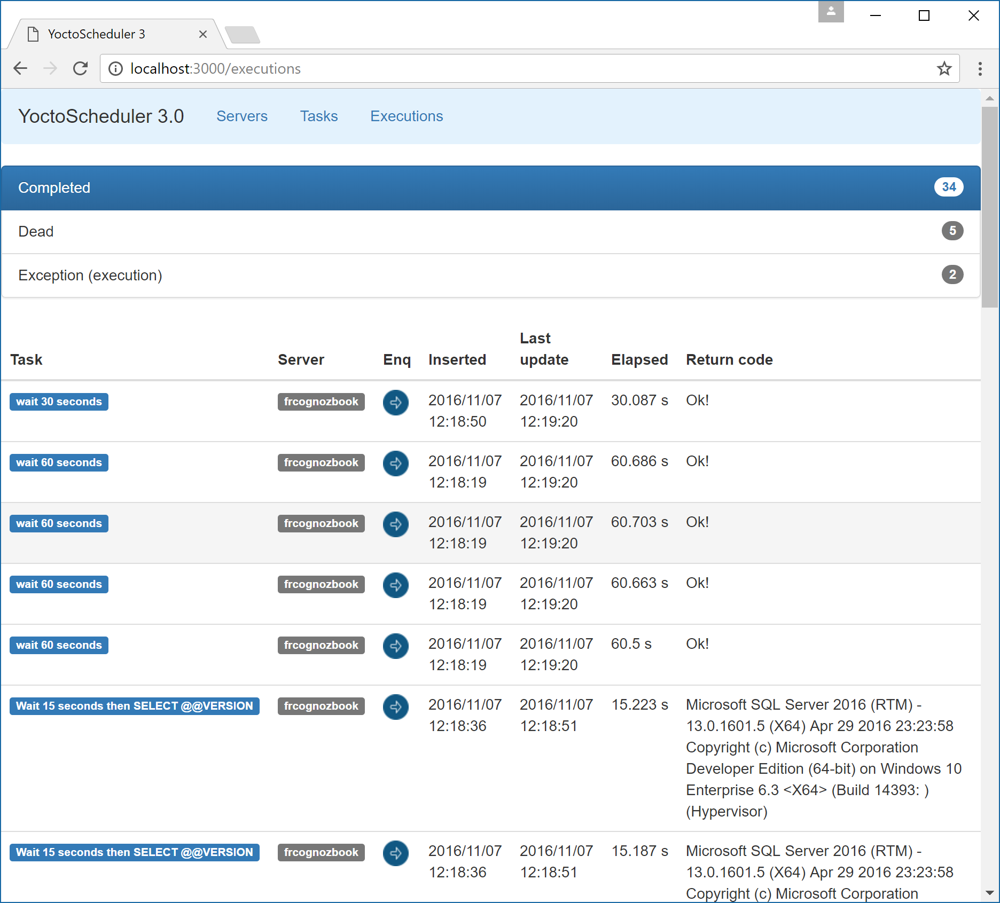

## Intro
YoctoScheduler is a muli-thread, multi-process scheduling system. It is meant to be a SQL Server Agent replacement for Azure workloads.  
Each server in  a cluster should be indpendent from the others while maintaining some architectural constraints.

The configuration data is stored in an Azure SQL Database or SQL Server database. Each scheduler process will start, read the configuration from the shared database and start processing tasks. 
The schedulers are *greedy*, meaning they compete for tasks to execute. You can control how many instances of a task can start concurrently (both on the same server and globally) via a specific configuration option. The schedules, however, are guaranteed to be executed only once (this is different from multi instance SQL Server Agent, ie. AlwaysOn in which you have to manually handle concurrency) so you don't need to concern yourself with it. 
The tasks can be:
  * T-SQL tasks (ie everything you can do from a SqlConnection).
  * SSIS tasks (provided you have SSIS engine available).
  * PowerShell tasks.

As this version there is no workflow to specify. Each task is indipendent. Depending on the need of this we will implemement the feature in the future.

### Resiliency

The schedulers are build with the cloud in mind. That means they are resilient: you can have a scheduler pick up a task previously being run by another, failed, scheduler. This happens automatically and, of course, you can opt out if you want. 

This is an example of what can happen. Suppose we have two instances of our scheduler (maybe in an availability group):


Suppose now Server_A picks up a task (called Job_01) and starts executing it:


Job_01 can be running as result of a schedule or maybe we just started it manually. It does not matter. What matter is we marked Job_01 as *restartable* in case of server failure.

Now let's suppose Server_A fails.


Server_B, after declaring Server_A dead, will pick Job_01 and start executing again.



This does not require manual intervention. Please note that the scheduler does not make assumption on the atomicity of the task restarted. It's up to you to provide transactionality (if needed).

## Legend

Entity Name | Description
------------|---------|
Task | Atomic execution block. A task will never migrate between servers. |
Server | Schedulator and executor process. A server manipulates the companion database.
Task status | A ```task``` can either be alive or dead. If not alive there is also a description of why is not running.
Schedule | A predefined fire time for a ```Task```. It supports the ```NCronTab``` syntax to be flexible (up to the single minute).
Workflow | A collection of task to be orchestrated as a single entity.

## Requisites

### Done
* Each server must be independent and must rely on the companion database only.
* A schedule must fire at most *once*.
* If a schedule fires when there are no servers running the schedule is *lost*.
* Each task should be atomic and transactional. A task might fail at any moment and can be restarted on the same server (or another one).
  > this constraint can be relaxed at first
* Each task must update its status at least each ***to_define_task_update_frequency*** seconds. An update will update the ```LastUpdate``` field in the ```[live].[ExecutionStatus]``` table.
* A task not updating its status for ***to_define_task_timeout*** seconds is considered dead. A dead task will be removed from the ```[live].[ExecutionStatus]``` table and placed in the ```[dead].[ExecutionStatus]``` table (along with a specific status).
* A dead task will be restarted if so specified (the ***restart logic is to be defined***).
* Each task can specify concurrency limits, both globally and in the same server. For example, a task might run on an unlimited number of different servers but each server should only run one instance. The concurrency check must be performed by the server at runtime at it should be conservative: better to avoid starting a task is there's the possibility of exceeding the maximum configured parallelism even if it's not a certainty.
* Each task should read its configuration from the centralized server (to encourage task independence).
* Required tasks:
  * T-SQL task
  * PowerShell task
  * SSIS task


### ToDo

#### Mandatory
* PowerShell cmdlets. They are fairly easy to implement as they can only wrap the REST API calls.

#### Nice to have
* Tasks can spawn another task(s) as result of their elaboration.
* You can create workflows that chain task based on:
  * Status (successful, failed, in exception)
  * Constant match (ie ```if return number = 1 then ... else if ...```)
  * Resources available
* The server can schedule concurrent tasks inspecting the available resources (to better scale in parallel).

## Requisites

* SQL Server 2012+ or SQL Azure database.
* A database and a ```dbo_owner``` user with relative login.
* C# 4.5.2. 

## Installation
YoctoScheduler can run in two modes, as a command line program or as a Windows Service. The [configuration](docs/configuration.md) is the same, the only difference is in the command line switches that either start the command line execution or register the windows service.

1. Execute the [oop-tsql/00-create.sql](oop-tsql/00-create.sql) script on your chosen database instance. This will create the required database.
2. Create a login in the database instance and give it ```db_owner``` on the previously created database.
3. Compile the executable and relative libraries.
4. [Configure](docs/configuration.md).
5. Run (for testing purposes you may want to start with the command line program).
6. *optional* Clone the web frontend (it's in a separate project right now). Once cloned make sure to configure the server files accordingly.

## Configuration

See the specific section: [configuration](docs/configuration.md).

## Interaction

Check out the [REST API reference](docs/rest/rest.md), the command line commands are deprecated and will be removed in the future.

## Testing

Here are some testing REST commands you can send to your YoctoScheduler instance. All the commands are server-agnostic so there is no difference based on which server instance you pick. Also note this samples use the linux curl command line tool. You can download a copy for Windows from [wingw.org](http://www.mingw.org/) but some commands migth require some tweaking as windows and linux handle special characters differently.

### Secret

You can create a secret using the [```SecretItems```](docs/rest/secret-item.md) REST API command. You have to specify the certificate thumbprint (as found in ```My``` certificate store) and the text to encrypt. The Secret name must be unique otherwise the call will fail.

```
curl -X POST -H "Content-Type: application/json" cantun.mindflavor.it:9000/api/secretitems -d '{"Name":"MyConnectionString", "CertificateThumbprint":"277103c882995da2d199050e58522d364513307e", "PlainTextValue":"data source=vSQL14A.mindflavor.it;initial catalog=YoctoScheduler;User Id=fagiolo;Password=cotto;MultipleActiveResultSets=False;App=YoctoTask"}"'
```

You can call the same REST API in a browser to get the secret list:


Notice how the value is stored in its encrypted format only.

*Note:* There is a bug in PowerShell generated certificates. See the [```System.Security.Cryptography.CryptographicException: Invalid provider type specified```](docs/known-issues/System.Security.Cryptography.CryptographicException.md) known issue about how to resolve this.

### Task
You can add a new mock task calling the [Tasks REST API](docs/rest/tasks.md) interface.

In a nutshell the task is defined by:
* Name
* Type (TSQL task, PowerShell task, etc...)
* Server failure resiliency (whether it should be executed again if the hosting server dies before its completion)* Concurrency limits (both global and local, use 0 for unconstrained)
* Payload (task-dependent)

#### Wait task
For example this is how to create a ```WaitTask``` (useful ony for debugging purposes):

```
curl -X POST -H "Content-Type: application/json" cantun.mindflavor.it:9000/api/tasks -d '{"Name":"MyWaitTask", "ConcurrencyLimitGlobal":0, "ConcurrencyLimitSameInstance":1, "Description":"This task will stall the thread for 35 seconds. This task will task will not be requeued in case the server owning it dies", "ReenqueueOnDead":false,"Type":"WaitTask","Payload":"{\"SleepSeconds\":35}"'
```

You can create a ```WaitTask``` using the web app by clicking Add in the Task view: 


#### T-SQL task
Here is how you create a ```TSQLTask```:

```
curl -X POST -H "Content-Type: application/json" cantun.mindflavor.it:9000/api/tasks -d '{"Name":"MyDBTask_WithWait", "ConcurrencyLimitGlobal":2, "ConcurrencyLimitSameInstance":2,  "Description":"SELECT @@VERSION after WAITFOR DELAY of 30 seconds", "ReenqueueOnDead":true,"Type":"TSQLTask","Payload":"{\"ConnectionString\":\"%%[MyConnectionString]%%\", \"Statement\":\"WAITFOR DELAY \u002700:00:30\u0027; SELECT @@VERSION;\",\"CommandTimeout\":600}"'
```

For reference, here is the above task's payload:

```json
{
  "Name": "MyDBTask_WithWait",
  "ConcurrencyLimitGlobal": 2,
  "ConcurrencyLimitSameInstance": 2,
  "Description": "SELECT @@VERSION after WAITFOR DELAY of 30 seconds",
  "ReenqueueOnDead": true,
  "Type": "TSQLTask",
  "Payload": "{\"ConnectionString\":\"%%[MyConnectionString]%%\", \"Statement\":\"WAITFOR DELAY '00:00:30'; SELECT @@VERSION;\",\"CommandTimeout\":600"
}
```

Notice how you can embed the ```Secret``` surrounding it with ```[%%``` and ```%%]```. This syntax is supported by JSON based tasks.

You can create T-SQL tasks and display the existing ones using the ```REST API``` or using the YoctoScheduler web app:

. 

Notice how the webapp makes sure your're passing the parameters correctly.

#### PowerShell task

PowerShell tasks accept only one parameter: Script. The output entries will be JSON serialized row by row (calling ```ToString()``` on them first). Here is an example that enumerates local drives along with used and free space:

```
curl -X POST -H "Content-Type: application/json" cantun.mindflavor.it:9000/api/tasks -d '{"Name":"My_PS_Drives", "ConcurrencyLimitGlobal":0, "ConcurrencyLimitSameInstance":1, "Description":"This task will enumerate local drives", "ReenqueueOnDead":true,"Type":"PowerShellTask","Payload":"{\"Script\":\"Get-PSDrive | foreach { $_.Name, $_.Root, $_.Used, $_.Free | Out-String }\"}"'
```

For reference, here is the configuration JSON:

```json
{
  "Name": "My_PS_Drives",
  "ConcurrencyLimitGlobal": 0,
  "ConcurrencyLimitSameInstance": 1,
  "Description": "This task will enumerate local drives",
  "ReenqueueOnDead": true,
  "Type": "PowerShellTask",
  "Payload": "{\"Script\":\"Get-PSDrive | foreach { $_.Name, $_.Root, $_.Used, $_.Free | Out-String }\"}"
}
```

The output, as stated above, is serialized to a JSON. In my case this is the output:

```json
[
  {
    "Row": "Alias\r\n\r\n"
  },
  {
    "Row": "C\r\nC:\\\r\n590391623680\r\n304360370176\r\n"
  },
  {
    "Row": "Cert\r\n\\\r\n"
  },
  {
    "Row": "E\r\nE:\\\r\n165277347840\r\n334827339776\r\n"
  },
  {
    "Row": "Env\r\n\r\n"
  },
  {
    "Row": "F\r\nF:\\\r\n0\r\n"
  },
  {
    "Row": "Function\r\n\r\n"
  },
  {
    "Row": "G\r\nG:\\\r\n0\r\n"
  },
  {
    "Row": "H\r\nH:\\\r\n164171661312\r\n836029329408\r\n"
  },
  {
    "Row": "HKCU\r\nHKEY_CURRENT_USER\r\n"
  },
  {
    "Row": "HKLM\r\nHKEY_LOCAL_MACHINE\r\n"
  },
  {
    "Row": "Variable\r\n\r\n"
  },
  {
    "Row": "W\r\nW:\\\r\n97070129152\r\n142726615040\r\n"
  },
  {
    "Row": "WSMan\r\n\r\n"
  }
]
```

You can pivot it in a table using SQL Server 2016 JSON features like this:

```sql
DECLARE @var NVARCHAR(MAX);
SELECT @var = ReturnCode FROM [YoctoScheduler].[dead].[ExecutionStatus] S INNER JOIN [YoctoScheduler].[live].[Tasks] T ON S.TaskID = T.TaskID
WHERE T.[Type] = 'PowerShellTask' AND GUID = '3B3B80D2-30A7-4D84-9486-16FB890603DC'

SELECT *
 FROM OPENJSON (@var, '$')
 WITH (
        Row NVARCHAR(MAX)
 ) AS OrdersArray
```



You can use the webapp to create ```PowerShell``` tasks.

### Schedule

To add a schedule just call the [```schedules``` REST API](docs/rest/schedule.md) interface. For example this command will schedule the task with ID 1 every minute:

```
curl -X POST -H "Content-Type: application/json" cantun.mindflavor.it:9000/api/schedules -d '{"Cron":"* * * * *","Enabled":true,"TaskID":1}'
```

Schedules support the CRON syntax via [NCrontab](https://github.com/atifaziz/NCrontab). For details please refer here: [https://github.com/atifaziz/NCrontab](https://github.com/atifaziz/NCrontab).

Schedules can be retrieved via REST interface. The web app does not yet support creating schedules but should be developed soon.

## Direct Execution

You can also enqueue a task for immediate execution instead of scheduling it. Just call the [```queueitems``` REST API](docs/rest/queueitem.md) interface specifying the TaskID and its priority:

```
curl -X POST -H "Content-Type: application/json" cantun.mindflavor.it:9000/api/queueitems -d '{"TaskID":1,"Priority":1}'
```

Scheduled task will start as soon as the concurrency conditions are met. You can also query the execution queue using the same interface.

You can enqueue a task to be executed using the web interface under the task section. Notice you can pick the priority:


> Right now you cannot choose which server will execute the task. Is this right or we should change it?

## Execution Lists

There are three different ```REST API``` interfaces for execution inspection: [alive](docs/rest/LiveExecution.md) and [completed](docs/rest/DeadExecution.md) executions.  You can also call the global [executions](docs/rest/executions.md) which will include both plus the queued tasks. These interfaces are GET only, that is you cannot post to them. The global will support delete in order to remove old entries. The ```Executions``` tab in the web interface shows the tasks, grouped by status:



The Task web app page updates itself so you don't need to refresh it.

## Known issues

* [```System.Security.Cryptography.CryptographicException: Invalid provider type specified```](docs/known-issues/System.Security.Cryptography.CryptographicException.md).

* [```Access denied``` during Owin initialization](docs/known-issues/owin-access-denied.md).

* [```Bad Length``` during secret encryption](docs/known-issues/bad-length-encryption.md).


## Debug

TODO

## License
Please see the [LICENSE](LICENSE) file for details.
